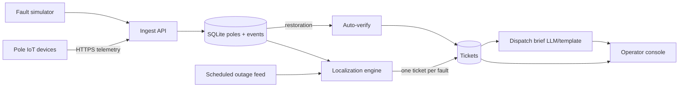

# Architecture

## Data flow

## Ingestion

- `POST /api/telemetry` and `/api/telemetry/batch`
- Dedup on `(device_id, seq)` unique constraint
- Per-pole `last_seq`: apply state only for newer seq; `boot` / seq 0 resets
- Out-of-order older seq kept for audit, does not rewind state
- Stale `power_lost` older than 6h with non-increasing seq dropped
- Trust `pole_id` over `device_id`; device swaps update the mapping

Production note: NB-IoT → MQTT would land in the same ingest function via a thin consumer.

## Storage / topology model

- Tables: `feeders`, `transformers`, `poles`, `telemetry_events`, `scheduled_outages`, `tickets`
- Network is a **forest of trees** rooted at each DT
- Each pole stores:
  - `parent_pole_id` / `seq_on_line` when recorded (~40% of DTs)
  - `inferred_parent_id` always, computed at seed via geographic radial spanning tree

### Missing topology (the 60%)

For DTs without recorded order we **infer** parents: grow a tree from the DT by repeatedly attaching the remaining pole with the cheapest link to an already-attached node that is not farther from the DT (15 m GPS slack). Long jumps are penalized.

| Mode | Localization | Confidence |
|------|--------------|------------|
| Recorded parents | Span-level boundary | ~0.75–0.90 |
| Inferred parents | Span-level with caveat in UI | ~0.45–0.70 |
| Ambiguous / sparse telemetry | Still emit span or DT ticket with low confidence + reason | lower |

Failure modes of inference: parallel branches within GPS noise; poles that fold back toward the DT; missing intermediate poles without devices → reported span may be adjacent to the true edge. The UI labels topology source explicitly.

Long-term: recommend a department survey of parent/seq for high-complaint DTs first; optionally learn topology from co-darkening history (not implemented — would need weeks of data).

## Localization algorithm

Sensors report **nodes**; faults live on **edges**. Signature of a span fault: last live pole / first dark pole.

Per DT:

1. Build children map from recorded or inferred parents.
2. Classify poles live / dark / unknown (no device or stale silence ≠ confirmed dark).
3. **Sensor failure:** dark pole with live descendants → suppress (physically impossible as line fault).
4. **DT fault:** no live reporting poles, enough dark → ticket at DT.
5. **Span faults:** dark roots whose parent is live (or DT); each root’s dark subtree is one incident. Nested roots collapsed so one snapped wire → one ticket.
6. **Feeder fault:** ≥70% of DTs on a feeder fully dark → one feeder ticket; skip per-DT tickets.
7. **Scheduled outages:** suppress tickets if feeder/DT is in feed window ±30 min grace (late starts / overruns). Cancelled flag respected. Feed is not treated as gospel beyond that.

Complexity: O(P) per touched DT (P = poles under DT). Full subdivision scan O(total poles).

Known failure cases:

- Entire dying-message loss + fw 1.2 silence on a small spur → delayed or missed until heartbeat timeout logic (we currently require confirmed dark; simulator also forces physical dark).
- Inferred topology wrong → wrong adjacent span (mitigated by confidence + UI caveat).
- Two real faults on same line minutes apart may still be two tickets (intentional).

## Noise handling

| Signal | Handling |
|--------|----------|
| Dead modem / lamp circuit | Live children ⇒ suppress |
| fw 1.2 quiet loss | Simulator marks dark without `power_lost`; detection uses energized state |
| Scheduled load shedding | Suppress via outage feed + grace |
| Duplicates / retries | seq dedup |
| Burst after outage | Batch ingest + single detection pass |

## Ticket workflow

`detected → acknowledged → crew_assigned → resolved → verified → closed`

- **Resolved** rejected if telemetry still shows dark poles (`409 telemetry_conflict`).
- **Verified** set automatically when enough affected devices report live again — not by operator click alone.

## API surface

| Method | Path | Purpose |
|--------|------|---------|
| GET | `/api/health` | Liveness |
| GET | `/api/stats` | Counts for console header |
| POST | `/api/telemetry` | Single device message |
| POST | `/api/telemetry/batch` | Burst ingest |
| GET | `/api/tickets` | List tickets |
| GET | `/api/tickets/{id}` | Detail |
| POST | `/api/tickets/{id}/transition` | Lifecycle |
| POST | `/api/tickets/{id}/brief` | AI / template brief |
| GET | `/api/network/poles` | Map data |
| GET | `/api/network/transformers` | DT markers |
| GET | `/api/network/feeders` | Feeders |
| GET | `/api/scheduled-outages` | Mock planned outages |
| POST | `/api/simulator/*` | span, dt, feeder, dead-sensor, scheduled-outage, repair |
| POST | `/api/admin/reseed` | Rebuild synthetic network |

## Operator UI

Designed for a non-engineer at 2 a.m.:

- **Left:** open incidents first — asset, status, PIN, confidence, topology mode
- **Center:** map — dark poles + fault pin + span line; DTs colored by topology quality
- **Right:** one ticket’s navigate-to coords, impact, confidence reason, workflow buttons, simulator

Deliberately omitted: charts, historical analytics, crew routing, auth chrome, per-pole alert spam.

## AI feature

**Dispatch brief:** LLM turns structured ticket JSON into a short operator briefing. Localization remains deterministic graph logic.

- With `OPENAI_API_KEY`: OpenAI chat completion
- Without / on failure: deterministic template (deploy always works)
- Cost: ~few hundred tokens per brief, on demand only

Why here and not localization: briefs are language work; localization must be instant, free, explainable, and testable.
